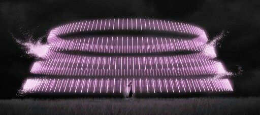

# Senbonzakura

**Multi-direction refusal abliteration for transformer language models.**

<p align="center">
  
</p>

Senbonzakura removes the refusal behaviour from an open-weight language model by
finding the *directions* in its activation space that carry "I can't help with
that" and orthogonalising them out of the weights. It builds on the
single-direction method of Arditi et al. and the automated search of Heretic, and
adds the one thing that moved the needle in my own runs: cutting in **several
directions at once**, not just one.

Named for Byakuya Kuchiki's zanpakutō, the sword that scatters into a thousand
blades. Refusal is not one blade. It's many.

## Why multi-direction

The original finding ([Arditi et al., 2024](https://arxiv.org/abs/2406.11717)) is that refusal is *mostly* one
direction. Mostly. The last stubborn few percent lives in a small handful of
nearby directions the single-arrow method never sees. Account for a refusal
*subspace* instead of a single vector and the residual refusals fall the rest of
the way, without the model losing its coherence.

On Qwen3-1.7B, over the same 290-prompt evaluation:

| Configuration | Hard refusal | Strict (Heretic keyword) | Broken |
|---|--:|--:|--:|
| Stock, uncut | 6.2% | 45.5% | 0.0% |
| Single direction | 2.4% | 40.3% | 0.0% |
| **Senbonzakura (multi-direction)** | **1.0%** | **21.7%** | **0.0%** |

The single-direction pass barely touches the strict count; multi-direction
roughly halves it, with no broken output. For the direct comparison against
Heretic on identical hardware, see [Benchmark](#benchmark).

## How it works

1. **Extract the refusal subspace.** For a few hundred harmful and harmless
   prompts, record the last-token residual at every layer. The difference of
   means (harmful minus harmless), good-orthogonalised, is the primary refusal
   direction; up to K-1 further axes come from a PCA of the harmful residual
   cloud. Together they span the refusal subspace at each layer.
2. **Search (Optuna).** An NSGA-II search over which layers to cut, how strongly,
   how many directions, and per-layer directions versus a single interpolated one,
   maps the whole refusals-versus-coherence frontier. Each trial applies the
   *real* norm-preserving weight bake and restores from a pristine snapshot, so
   the search scores the exact model it will save, with no proxy gap. Coherence is
   protected directly by a KL-divergence term against the original model on
   harmless prompts.
3. **Bake.** For the winning configuration, orthogonalise the refusal span out of
   every residual-writing weight (each attention output projection and each MLP
   down-projection, including the fused expert tensors of mixture-of-experts
   models) so the change is permanent. Save.

The result is a model that has lost the machinery of refusal, not one that has
been told to ignore it.

## Install

```sh
pip install .          # or:  uv pip install .   (torch, transformers, accelerate, datasets, optuna)
senbonzakura --help    # console command; equivalently: python -m senbonzakura --help
```

To score a large model on a low-VRAM card, `pip install ".[quant]"` adds 4-bit
(bitsandbytes) loading **for the scorer**: `python -m senbonzakura.score --load-in-4bit`.
The abliterator itself runs in full precision, because it rewrites weights and 4-bit
tensors can't be orthogonalised in place, so `--load-in-4bit` is a measurement option, not
an abliteration one. A man page is installed to `share/man/man1/senbonzakura.1`.

Supported architectures: dense transformers (Llama, Qwen, Mistral, Gemma, Phi and the
like), fused-expert MoE (Qwen3-MoE, Granite-MoE), Mixtral (fused or unfused), OLMoE, and
shared-expert MoE (Qwen2-MoE, DeepSeek-MoE). An unsupported layout fails loudly at load
rather than silently under-ablating.

## Usage

The fast path, if you just want the best result and no knob-twiddling:

```sh
senbonzakura kageyoshi --model <hf-model-or-path> --out <dir> --track <dir> --device cuda
```

`kageyoshi` is the ultimate balanced-effort mode. It detects the
architecture (dense, fused MoE, or expert-list) and parameter count, scales the
search budget accordingly, and switches on every quality lever, so you supply only
the paths. "Balanced" is the point here. It picks the most uncensored config that stays
coherent (the KL ceiling and coherence penalty guard it), not the most aggressive
one. It owns the search knobs; manual `--trials` / `--max-directions` and friends
are ignored in this mode. If a `hedge_ds/` sits in your track directory it folds the
hedging axis in automatically.

For full manual control:

```sh
senbonzakura --model <hf-model-or-path> --out <dir> \
    --track <dir-holding-bad_ds-good_ds-bad_eval_ds> \
    --search pareto --max-directions 6 --trials 200 --device cuda \
    --eval-refusal-final 256 --patience 40
```

Score any model on a held-out evaluation set with the same ruler:

```sh
python -m senbonzakura.score --model <dir> --eval <eval-dataset> --out results.json --label mymodel
```

`senbonzakura.metrics` is that shared ruler: hard refusal, soft refusal (the "I
can't, but here's a lecture" hedge), broken output, and the Heretic keyword rate
(copied verbatim, so the numbers are directly comparable to Heretic's published
figures).

### Notable flags (`senbonzakura --help` for all)

- `--max-directions K` — size of the refusal subspace to ablate (1 = single-direction).
- `--mlp-off` — attention-only ablation (leave `mlp.down_proj` untouched); tests the
  "attention carries refusal, MLP carries capability" hypothesis.
- `--hedge-ds DIR` — fold a hedged-vs-clean contrast direction into the basis, so the
  search can strip the disclaimer/hedging axis the difference-of-means direction misses.
- `--patience N` — stop the search once the frontier stalls for N trials.
- `--eval-refusal-final N` — re-score the top frontier candidates on a larger eval before
  picking the knee, so the choice isn't overfit to the small search eval.
- `--inspect LAYER STRENGTH` — print real generations before and after a cut.

The search minimises **three** objectives at once: strict non-compliance
(hard refusal plus hedging), the Heretic keyword rate as its own axis, and KL
divergence (coherence). Earlier versions optimised only hard-refusal-versus-KL and
left the keyword/hedging axis to chance.

## Benchmark

Head-to-head against [Heretic](https://github.com/p-e-w/heretic) on Qwen3-1.7B: same base
model, a 290-prompt evaluation scored with the same ruler, an equal 200-trial search budget
on the same GPU. The honest read is a trade-off, not a clean sweep:

| Model | Hard refusal | Heretic keyword | Coherence (PPL, base 20.40) |
|---|--:|--:|--:|
| Heretic (default) | 0.0% | **5.5%** | 20.44 |
| Senbonzakura (multi-direction) | **0.7%** | 40.0% | **20.16** |

With regards to **Coherence**, Senbonzakura lands level with the base model's
perplexity while ablating (20.16 vs 20.40; a delta this small is within run-to-run noise,
so read it as a tie, not a win). With regards to **Refusal suppression on Heretic's own
keyword metric**, Heretic wins clearly (5.5% vs 40.0%). The gap is not hard refusals (both
are near zero) but residual *hedging* language that the keyword rate flags on
otherwise-complying answers.

### Reproducibility and status

Honest caveats on the numbers above, and in the table under [Why multi-direction](#why-multi-direction):

- **Single run, seed 42.** The Optuna sampler is seeded, but GPU kernels (matmul reductions,
  SVD) are not bit-deterministic, so a re-run can differ by a percent or two. No error bars are
  reported; treat small differences as noise.
- **The two tables come from different development runs and configurations** (trial budget,
  hedging set on/off, eval slice), so their keyword-rate figures for Senbonzakura are not directly
  comparable to each other. A single consolidated, reproducible benchmark is the right fix.
- **These figures predate the correctness fixes** to direction extraction (a left-padding
  last-token bug), the multi-direction basis (a class-separation filter so the extra axes are
  refusal, not topic variance), and knee selection (which now weights the keyword axis it always
  searched). Each changes the numbers, mostly in Senbonzakura's favour on the keyword axis, so the
  table is being **re-measured** and will be republished once the re-run is complete. Until then,
  read the current figures as indicative, and the coherence result as the durable claim.

## What this repository does not contain

By design, this is methods and results, not a loaded weapon:

- **No pre-abliterated model weights.** Run the tool yourself.
- **No harmful prompt sets.** The contrast and evaluation data you supply are your
  own; none ship here.
- **No harmful outputs.**

Abliteration removes safety guardrails wholesale. That is both the point and the
danger. Use it accordingly.

Note on licences: this tool is Apache-2.0, but a model you abliterate keeps the **base
model's** licence and use restrictions. Redistributing an abliterated checkpoint is governed
by that upstream licence (Qwen, Llama, Gemma and so on), not by this repository's.

## Credit

- Arditi, Obeso, et al. [*Refusal in Language Models Is Mediated by a Single
  Direction*](https://arxiv.org/abs/2406.11717) (2024). The direction method this builds on.
- [Heretic](https://github.com/p-e-w/heretic) by p-e-w. The automated,
  KL-guarded search this refines, and the keyword metric reported here for
  comparison.
- Maxime Labonne. [*Uncensor any LLM with abliteration*](https://huggingface.co/blog/mlabonne/abliteration). The tutorial that
  popularised the technique.

## Licence

Apache-2.0. See [LICENSE](LICENSE).
